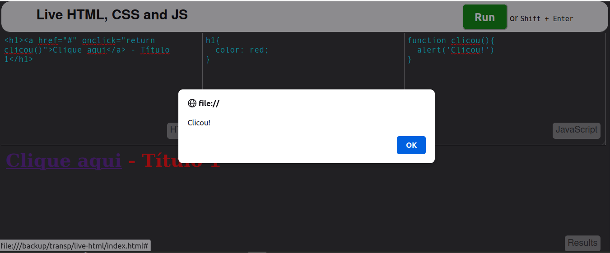

# HTML, CSS, Javascript Lives
Um ótimo e simples editor que mostra o resultado do código que estamos criando ao vivo.

## Fork
Este é um fork do projeto
https://github.com/sayhelloelijah/say-codeplayer
Quase sem alterações

Veja um exemplo em que criei um h1 com um link para uma função em js e um css para mudar a cor do h1

